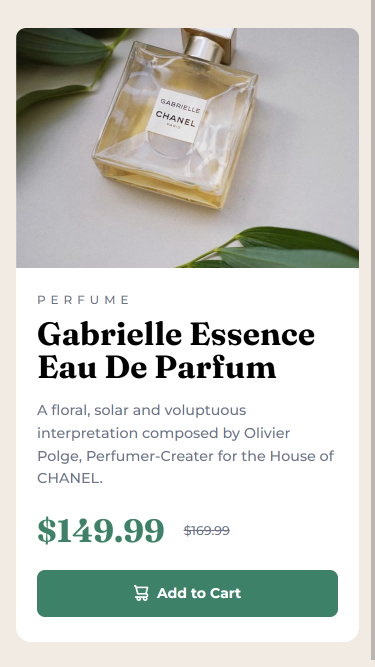

# Frontend Mentor - Product preview card component solution

This is a solution to the [Product preview card component challenge on Frontend Mentor](https://www.frontendmentor.io/challenges/product-preview-card-component-GO7UmttRfa). Frontend Mentor challenges help you improve your coding skills by building realistic projects.

## Table of contents

- [Overview](#overview)
  - [The challenge](#the-challenge)
  - [Screenshot](#screenshot)
  - [Links](#links)
- [My process](#my-process)
  - [Built with](#built-with)
  - [What I learned](#what-i-learned)
  - [Continued development](#continued-development)
  - [Useful resources](#useful-resources)
- [Author](#author)
- [Acknowledgments](#acknowledgments)

**Note: Delete this note and update the table of contents based on what sections you keep.**

## Overview

### The challenge

This challenge required the recreation of the web pages provided using desktop and mobile UI resolutions. The displayed pages should be responsive to changes in width.

### Screenshot

### Links

- Solution URL: [Github](https://github.com/Devs-advocate/product-preview-card-component)
- Live Site URL: [Github Pages](https://devs-advocate.github.io/product-preview-card-component)

## My process

This challenge is part of the learning path for responsive design. I did some of the recommended research on the topic before attempting the challenge.
I also used the mobile-first approach.

### Built with

- Semantic HTML5 markup
- CSS custom properties
- Flexbox
- Mobile-first workflow

### What I learned

CSS is tough and finnicky, and making good decisions about how to achieve an outcome is important, because every aspect after is affected by it. Of note, I learned how to use different images for different screen resolutions in HTML, using the srcset attribute.

### Continued development

The learning doesn't end, and there's still much to continually research. The use of images needs further work.

### Useful resources

- [Kevin Powell's free course on resonsive CSS](https://courses.kevinpowell.co/)
- [web.dev](https://web.dev/learn/design/welcome)

## Author

- Frontend Mentor - [@Devs-advocate](https://www.frontendmentor.io/profile/Devs-advocate)
